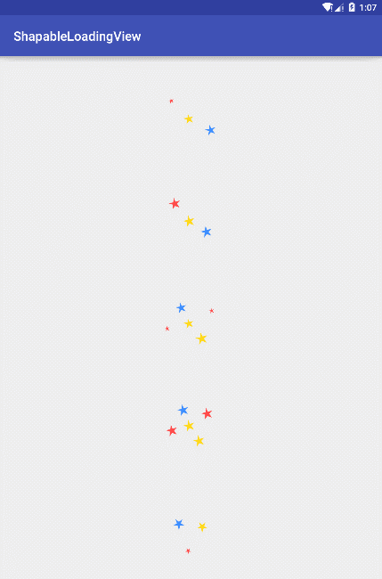

# ShapableLoadingView
----
##Intro

ShapableLoadingView is a highly configurable and customized library to do loading progress with any animated shapes for Android.

## Preview



## Usage

### 1. Add dependency

```
dependencies {
	...
	compile 'com.github.chaossss:ShapableLoadingView:1.0.1'
}
```

### 2. Add your xml code

such as:

```xml
<com.github.chaossss.shapableloadingview.ShapableLoadingView
            android:layout_margin="30dp"
            android:layout_width="100dp"
            android:layout_height="100dp"
            lib:numbers="3"
            lib:movement_cycle_time="3000"
            lib:rotate_cycle_time="100"
            lib:enable_rotate_animation="true"
            lib:enable_size_animation="true"
            lib:size_cycle_time="500"
            lib:min_shape_size="5dp"
            lib:max_shape_size="12dp"
            lib:shape_colors="@array/colors"
            android:layout_gravity="center" />
```

##Attr

| Attr | usage |
|---------|--------|
| numbers | numbers of the moving shape object |
| size_cycle_time | time about scaling from shape object's minSize to its maxSize |
| rotate_cycle_time | time about shape object rotate 360 degrees |
| movement_cycle_time | time about moving from path's begging to its end |
| shape_colors | shape object's color set |
| shape_size | shape object's size |
| enable_size_animation | enable size animation |
| enable_rotate_animation | enable rotate animation |
| min_shape_size | min shape size |
| max_shape_size | max shape size |
| path_type | shape object's moving path |
| shape_type | the moving object's shape |

###Plus

the attr "path_type", available:
-  infinite
-  square
-  triangle
-  circle
-  diamond
-  star
 
the attr "shape_type", available:
-  ball
-  star

## Customize

### 1. Create your own Path/Shape/both of them
```
public class YourPath extends AbstractPath {
    public YourPath(Point center, int pathWidth, int pathHeight, int maxBallSize) {
        super(center, pathWidth, pathHeight, maxBallSize);
    }

	//Draw your path here, and return it
    @Override
    public Path draw() {
        return null;
    }
}
```

```java
public class YourShape extends Shape {
    public YourShape(int size, int color) {
        super(size, color);
    }

	//Init points u need. Be careful, don't delete
	//the line of code 'super.initPoint();'
    @Override
    protected void initPoint() {
        super.initPoint();
    }

	//Update your point if needed
    @Override
    protected void updatePoint() {
        super.updatePoint();
    }

	//Draw your shape here
    @Override
    public Path getShapePath() {
        return null;
    }
}
```

### Create your ShapableLoadingView
```java
public class YourShapableLoadingView extends ShapableLoadingView {
    public YourShapableLoadingView(Context context) {
        super(context);
    }

    public YourShapableLoadingView(Context context, AttributeSet attrs) {
        super(context, attrs);
    }

    public YourShapableLoadingView(Context context, AttributeSet attrs, int defStyleAttr) {
        super(context, attrs, defStyleAttr);
    }

	//Return your path
    @Override
    protected Path getPath(int w, int h) {
        return super.getPath(w, h);
    }

	//Return your shape
    @Override
    protected Shape getShape(int color) {
        return super.getShape(color);
    }
}
```

## Thanks For

I'm so glad that, [**glomadrian**](https://github.com/glomadrian) agrees that I could create this project based on his library [**loading-balls**](https://github.com/glomadrian/loading-balls). So I could add some new feature and provides higher scalability.

License
============

    Copyright 2014 chaossss

	Licensed under the Apache License, Version 2.0 (the "License");
	you may not use this file except in compliance with the License.
	You may obtain a copy of the License at

     http://www.apache.org/licenses/LICENSE-2.0

	Unless required by applicable law or agreed to in writing, software
	distributed under the License is distributed on an "AS IS" BASIS,
	WITHOUT WARRANTIES OR CONDITIONS OF ANY KIND, either express or implied.
	See the License for the specific language governing permissions and
	limitations under the License.
